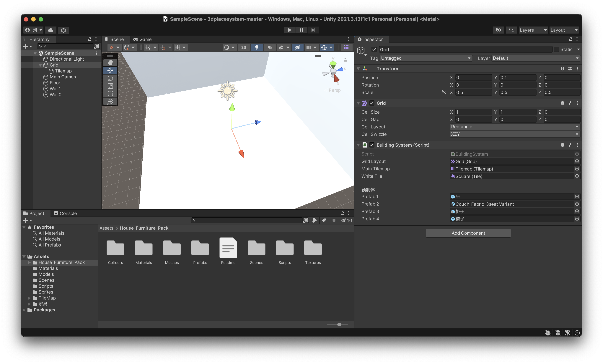

# Interior Design Application

This project is an interior design application developed in Unity, sponsored by Cuboid AI.

## Adding Components to Grid

Grid is considered as floor in our project. Follow the steps below to add the necessary components to the grid as shown in the picture.

### Step-by-Step Instructions

1. **Open the Floor Grid**
   - Ensure that the floor grid is visible in your Unity scene.

2. **Add the Components**
   - Choose the components you need to add.

3. **Add the Prefabs**
   - There is a list of prefab in the component "Building System"
   - Add the prefabs you want to generate in the scene.

### Reference Image

### Notes

- Ensure all components are added to the grid.
- Furniture cannot be placed if it overlaps with other items in the scene; it will be destroyed immediately upon such an attempt.

For further assistance, refer to the project documentation or contact the development team.
